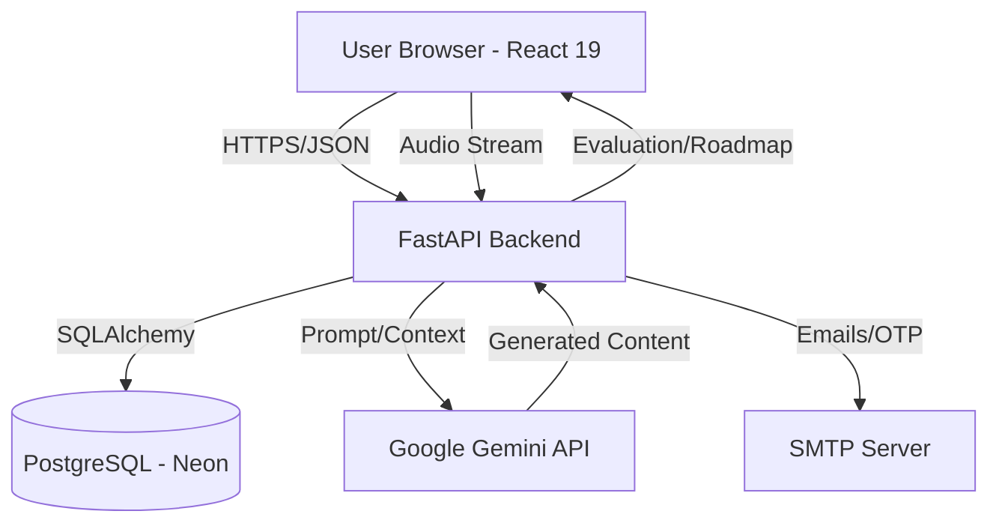

# Solvithem - AI-Powered Interview Preparation Platform

Solvithem is a cutting-edge, AI-driven platform designed to help candidates prepare for interviews through realistic simulations, real-time feedback, and personalized learning paths. Leveraging the power of Google Gemini AI, Solvithem provides both text and voice-based interview experiences.

---

## 🚀 Key Features

- **🤖 AI Mock Interviews**:
  - **Text-Based**: Practice technical, behavioral, and logical questions with real-time evaluation.
  - **Voice-Based**: Experience real-time audio interviews with speech-to-text processing and voice feedback.
- **📊 Smart Evaluation**: Get detailed feedback on your answers, including correctness, depth, and areas for improvement.
- **📄 CV Analysis**: Upload your resume to receive AI-powered insights and tailor your interview practice to your background.
- **🗺️ Personalized Roadmaps**: Generate custom learning roadmaps based on your target role and current skill level.
- **🔍 Multi-Category Questions**: Focus on Coding, DSA, System Design, Behavioral, Theoretical, or Quantitative/Logical reasoning.
- **🔐 Secure Auth**: Seamless login via Email OTP or Google OAuth2.

---

## 🏗️ System Architecture



---

## 🛠️ Technology Stack

### Frontend
- **Framework**: React 19 + Vite
- **Styling**: Tailwind CSS 4
- **Animations**: Framer Motion, Lottie React
- **Icons**: Lucide React
- **Charts**: Recharts (for performance visualization)
- **Navigation**: React Router 7

### Backend
- **Framework**: FastAPI (Python)
- **Database**: PostgreSQL with SQLAlchemy ORM
- **AI Engine**: Google Gemini API (`gemini-2.5-flash`)
- **Audio Processing**: Pydub, OpenAI Whisper (or similar transcription logic)
- **Authentication**: JWT, Google OAuth2, FastAPI Mail (for OTP)
- **Containerization**: Docker

---

## 📂 Project Structure

```text
solvithem/
├── backend/            # FastAPI Backend
│   ├── api/            # API Endpoints
│   │   ├── signup.py   # User registration & OTP
│   │   ├── interview.py # Interview logic
│   │   ├── roadmap.py  # AI Roadmap generation
│   │   └── analyze_cv.py # CV Parsing & Insights
│   ├── database.py     # DB Configuration
│   ├── model.py        # SQLAlchemy Models
│   ├── main.py         # Entry Point
│   └── requirements.txt
├── frontend/           # React Frontend
│   ├── src/
│   │   ├── components/ # Reusable UI Components
│   │   ├── pages/      # Page Views (Home, Interview, Profile)
│   │   └── App.jsx     # Main Application Logic
│   └── package.json
├── Dockerfile          # Multi-stage Docker build
└── uploads/            # Storage for resumes and audio files
```

---

## ⚙️ Setup & Installation

### Prerequisites
- Python 3.10+
- Node.js 18+
- PostgreSQL Database (Local or Neon.tech)
- Google Cloud Console Project (for OAuth2)
- Gemini API Key

### Local Development Setup

#### 1. Backend Setup
1. Navigate to the backend directory:
   ```bash
   cd backend
   ```
2. Create and activate a virtual environment:
   ```bash
   python -m venv venv
   source venv/bin/activate  # On Windows: venv\Scripts\activate
   ```
3. Install dependencies:
   ```bash
   pip install -r requirements.txt
   ```
4. Create a `.env` file (see Environment Variables section).
5. Run database migrations (if using Alembic):
   ```bash
   alembic upgrade head
   ```
6. Start the server:
   ```bash
   uvicorn main:app --reload --port 8000
   ```

#### 2. Frontend Setup
1. Navigate to the frontend directory:
   ```bash
   cd frontend
   ```
2. Install dependencies:
   ```bash
   npm install
   ```
3. Create a `.env` file:
   ```env
   VITE_API_URL=http://localhost:8000
   ```
4. Start the development server:
   ```bash
   npm run dev
   ```

---

## 🐳 Docker Deployment

The project includes a `Dockerfile` optimized for production (e.g., Google Cloud Run).

1. Build the image:
   ```bash
   docker build -t solvithem-backend .
   ```
2. Run the container:
   ```bash
   docker run -p 8080:8080 --env-file backend/.env solvithem-backend
   ```

---

## 🔑 API Reference (Highlights)

| Endpoint | Method | Description |
| :--- | :--- | :--- |
| `/signup` | `POST` | Registers user and sends OTP |
| `/verify-otp` | `POST` | Validates OTP and activates account |
| `/login` | `POST` | Authenticates user and returns JWT |
| `/generate-questions` | `POST` | Generates AI interview questions |
| `/process-voice-answer`| `POST` | Transcribes and processes audio answers |
| `/analyze-cv` | `POST` | Parses PDF CVs for skills and insights |
| `/roadmap/generate` | `POST` | Creates a custom learning roadmap |

---

## 🛡️ Security Features
- **JWT Authentication**: Secure stateless authentication for all protected routes.
- **OTP Verification**: Email-based verification for new signups.
- **CORS Middleware**: Restricted origins to prevent unauthorized cross-site requests.
- **Environment Isolation**: Sensitive keys managed via `.env` and never committed.

---

## 🗺️ Roadmap
- [ ] **AI Video Interview**: Real-time emotion and facial expression analysis.
- [ ] **Peer-to-Peer Mocking**: Real-time collaborative interview practice.
- [ ] **Company-Specific Templates**: Practice for specific roles at top tech firms (Google, Amazon, Meta).
- [ ] **Mobile App**: Dedicated iOS and Android clients using React Native.

---

## 🤝 Contributing

Contributions are welcome! Please follow these steps:
1. Fork the Project.
2. Create your Feature Branch (`git checkout -b feature/AmazingFeature`).
3. Commit your Changes (`git commit -m 'Add some AmazingFeature'`).
4. Push to the Branch (`git push origin feature/AmazingFeature`).
5. Open a Pull Request.

---

## 📝 License

Distributed under the MIT License. See `LICENSE` for more information.

---

Created with ❤️ by **Ayushman Singh**
